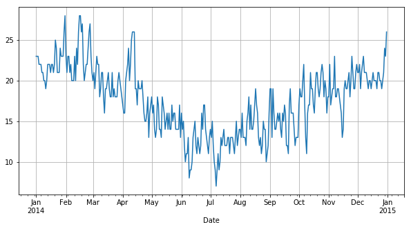
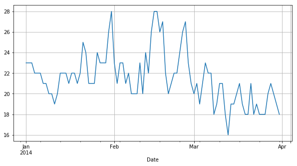
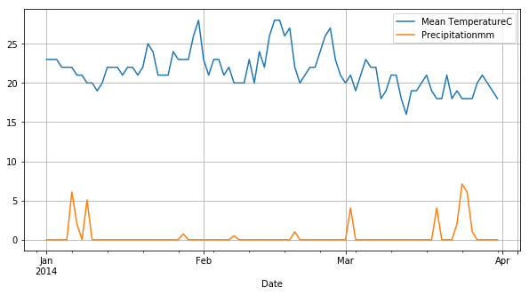
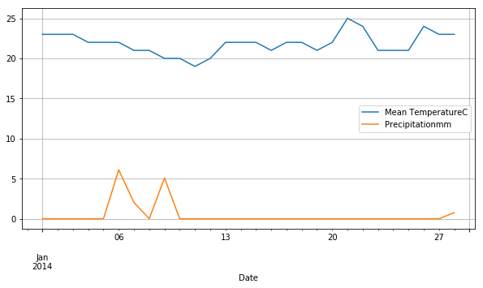
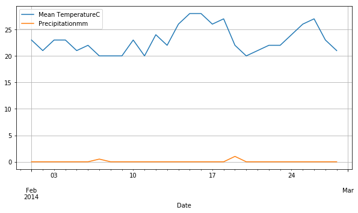
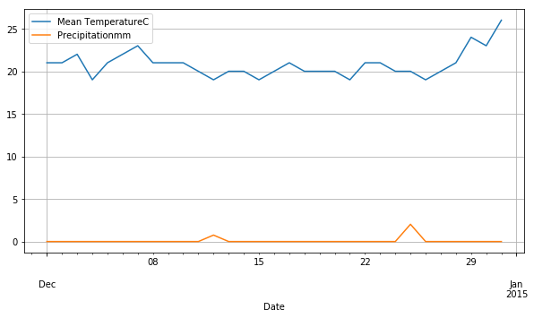

# Project 2:  Holiday weather

by Rob Griffiths, 11 September 2015, updated 11 April 2017

This is the project notebook for Week 2 of The Open University's [_Learn to code for Data Analysis_](http://futurelearn.com/courses/learn-to-code) course.

There is nothing I like better than taking a holiday. In the winter I like to have a two week break in a country where I can be guaranteed sunny dry days. In the summer I like to have two weeks off relaxing in my garden in London. However I'm often disappointed because I pick a fortnight when the weather is dull and it rains. So in this project I am going to use the historic weather data from the Weather Underground for London to try to predict two good weather weeks to take off as holiday next summer. Of course the weather in the summer of 2016 may be very different to 2014 but it should give me some indication of when would be a good time to take a summer break.

## Getting the data

Weather Underground keeps historical weather data collected in many airports around the world. Right-click on the following URL and choose 'Open Link in New Window' (or similar, depending on your browser):

http://www.wunderground.com/history

When the new page opens start typing 'London' in the 'Location' input box and when the pop up menu comes up with the option 'London, United Kingdom' select it and then click on 'Submit'. 

When the next page opens with London Heathrow data, click on the 'Custom' tab and select the time period From: 1 January 2014 to: 31 December 2014 and then click on 'Get History'. The data for that year should then be displayed further down the page. 

The data can be obtained month by month in CSV format. For example, the January 2014 data is available at this URL:

https://www.wunderground.com/history/airport/LHR/2014/1/1/MonthlyHistory.html?format=1

where LHR is the airport code. Changing the first 1 to 2, 3, etc. will show instead the data for February, March, etc. You can also change the 2014 in the URL to another year. 

The date column heading will be the timezone, e.g. 'GMT' (Greenwich Mean Time) for London, or the time offset, e.g. '-02'. It may even change throughout the year. For example, Delhi (aiport code DEL) is '+0430' from March to August and '+0330' in the other months.

You can copy each month's data directly from the browser to a text editor like Notepad or TextEdit, to obtain a single file with as many months as you wish.

Now load the CSV file into a dataframe making sure that any extra spaces are skipped:


```python
import warnings
warnings.simplefilter('ignore', FutureWarning)

from pandas import *
motherCity = read_csv('CapeTown_CPT_2014.csv', skipinitialspace=True)
```

## Cleaning the data
First we need to clean up the data. I'm not going to make use of `'WindDirDegrees'` in my analysis, but you might in yours so we'll rename `'WindDirDegrees< br />'` to `'WindDirDegrees'`. 


```python
motherCity = motherCity.rename(columns={'WindDirDegrees<br />' : 'WindDirDegrees'})
```

remove the  `< br />`  html line breaks from the values in the `'WindDirDegrees'` column. 


```python
motherCity['WindDirDegrees'] = motherCity['WindDirDegrees'].str.rstrip('<br />')
```

and change the values in the `'WindDirDegrees'` column to `float64`:


```python
motherCity['WindDirDegrees'] = motherCity['WindDirDegrees'].astype('float64')   
```

We definitely need to change the values in the `'GMT'` column into values of the `datetime64`  date type.


```python
motherCity['Date'] = to_datetime(motherCity['Date'])
```

We also need to change the index from the default to the `datetime64` values in the `'GMT'` column so that it is easier to pull out rows between particular dates and display more meaningful graphs: 


```python
motherCity.index = motherCity['Date']

```

## Finding a summer break

According to meteorologists, summer extends for the whole months of June, July, and August in the northern hemisphere and the whole months of December, January, and February in the southern hemisphere. So as I'm in the northern hemisphere, but from the southern hemisphere, I'm going to create a dataframe that holds just those months using the `datetime` index, like this:


```python
summer = motherCity.loc[datetime(2014,1,1) : datetime(2014,3,31)]
```

I now look for the days with warm temperatures.


```python
summer[summer['Mean TemperatureC'] >= 25]
```


<div>
<style scoped>
    .dataframe tbody tr th:only-of-type {
        vertical-align: middle;
    }

    .dataframe tbody tr th {
        vertical-align: top;
    }

    .dataframe thead th {
        text-align: right;
    }
</style>
<table border="1" class="dataframe">
  <thead>
    <tr style="text-align: right;">
      <th></th>
      <th>Date</th>
      <th>Max TemperatureC</th>
      <th>Mean TemperatureC</th>
      <th>Min TemperatureC</th>
      <th>Dew PointC</th>
      <th>MeanDew PointC</th>
      <th>Min DewpointC</th>
      <th>Max Humidity</th>
      <th>Mean Humidity</th>
      <th>Min Humidity</th>
      <th>...</th>
      <th>Max VisibilityKm</th>
      <th>Mean VisibilityKm</th>
      <th>Min VisibilitykM</th>
      <th>Max Wind SpeedKm/h</th>
      <th>Mean Wind SpeedKm/h</th>
      <th>Max Gust SpeedKm/h</th>
      <th>Precipitationmm</th>
      <th>CloudCover</th>
      <th>Events</th>
      <th>WindDirDegrees</th>
    </tr>
    <tr>
      <th>Date</th>
      <th></th>
      <th></th>
      <th></th>
      <th></th>
      <th></th>
      <th></th>
      <th></th>
      <th></th>
      <th></th>
      <th></th>
      <th></th>
      <th></th>
      <th></th>
      <th></th>
      <th></th>
      <th></th>
      <th></th>
      <th></th>
      <th></th>
      <th></th>
      <th></th>
    </tr>
  </thead>
  <tbody>
    <tr>
      <th>2014-01-21</th>
      <td>2014-01-21</td>
      <td>31</td>
      <td>25</td>
      <td>19</td>
      <td>18</td>
      <td>16</td>
      <td>14</td>
      <td>78</td>
      <td>58</td>
      <td>31</td>
      <td>...</td>
      <td>10.0</td>
      <td>10.0</td>
      <td>10.0</td>
      <td>35</td>
      <td>24</td>
      <td>45.0</td>
      <td>0.0</td>
      <td>1.0</td>
      <td>NaN</td>
      <td>207.0</td>
    </tr>
    <tr>
      <th>2014-01-30</th>
      <td>2014-01-30</td>
      <td>31</td>
      <td>26</td>
      <td>21</td>
      <td>19</td>
      <td>17</td>
      <td>15</td>
      <td>73</td>
      <td>59</td>
      <td>40</td>
      <td>...</td>
      <td>31.0</td>
      <td>13.0</td>
      <td>10.0</td>
      <td>37</td>
      <td>27</td>
      <td>NaN</td>
      <td>0.0</td>
      <td>1.0</td>
      <td>NaN</td>
      <td>169.0</td>
    </tr>
    <tr>
      <th>2014-01-31</th>
      <td>2014-01-31</td>
      <td>35</td>
      <td>28</td>
      <td>20</td>
      <td>20</td>
      <td>18</td>
      <td>15</td>
      <td>73</td>
      <td>56</td>
      <td>28</td>
      <td>...</td>
      <td>10.0</td>
      <td>10.0</td>
      <td>10.0</td>
      <td>24</td>
      <td>13</td>
      <td>NaN</td>
      <td>0.0</td>
      <td>1.0</td>
      <td>NaN</td>
      <td>205.0</td>
    </tr>
    <tr>
      <th>2014-02-14</th>
      <td>2014-02-14</td>
      <td>33</td>
      <td>26</td>
      <td>19</td>
      <td>20</td>
      <td>18</td>
      <td>15</td>
      <td>83</td>
      <td>60</td>
      <td>36</td>
      <td>...</td>
      <td>31.0</td>
      <td>14.0</td>
      <td>10.0</td>
      <td>35</td>
      <td>21</td>
      <td>NaN</td>
      <td>0.0</td>
      <td>1.0</td>
      <td>NaN</td>
      <td>172.0</td>
    </tr>
    <tr>
      <th>2014-02-15</th>
      <td>2014-02-15</td>
      <td>33</td>
      <td>28</td>
      <td>22</td>
      <td>21</td>
      <td>19</td>
      <td>18</td>
      <td>78</td>
      <td>64</td>
      <td>36</td>
      <td>...</td>
      <td>26.0</td>
      <td>16.0</td>
      <td>10.0</td>
      <td>34</td>
      <td>16</td>
      <td>NaN</td>
      <td>0.0</td>
      <td>1.0</td>
      <td>NaN</td>
      <td>195.0</td>
    </tr>
    <tr>
      <th>2014-02-16</th>
      <td>2014-02-16</td>
      <td>36</td>
      <td>28</td>
      <td>20</td>
      <td>21</td>
      <td>19</td>
      <td>17</td>
      <td>83</td>
      <td>61</td>
      <td>38</td>
      <td>...</td>
      <td>31.0</td>
      <td>22.0</td>
      <td>10.0</td>
      <td>29</td>
      <td>18</td>
      <td>NaN</td>
      <td>0.0</td>
      <td>1.0</td>
      <td>NaN</td>
      <td>202.0</td>
    </tr>
    <tr>
      <th>2014-02-17</th>
      <td>2014-02-17</td>
      <td>29</td>
      <td>26</td>
      <td>22</td>
      <td>21</td>
      <td>19</td>
      <td>16</td>
      <td>88</td>
      <td>69</td>
      <td>39</td>
      <td>...</td>
      <td>31.0</td>
      <td>14.0</td>
      <td>9.0</td>
      <td>34</td>
      <td>13</td>
      <td>NaN</td>
      <td>0.0</td>
      <td>4.0</td>
      <td>NaN</td>
      <td>205.0</td>
    </tr>
    <tr>
      <th>2014-02-18</th>
      <td>2014-02-18</td>
      <td>31</td>
      <td>27</td>
      <td>22</td>
      <td>21</td>
      <td>20</td>
      <td>18</td>
      <td>94</td>
      <td>68</td>
      <td>43</td>
      <td>...</td>
      <td>31.0</td>
      <td>12.0</td>
      <td>10.0</td>
      <td>42</td>
      <td>31</td>
      <td>NaN</td>
      <td>0.0</td>
      <td>1.0</td>
      <td>NaN</td>
      <td>174.0</td>
    </tr>
    <tr>
      <th>2014-02-25</th>
      <td>2014-02-25</td>
      <td>33</td>
      <td>26</td>
      <td>19</td>
      <td>17</td>
      <td>16</td>
      <td>14</td>
      <td>73</td>
      <td>55</td>
      <td>30</td>
      <td>...</td>
      <td>31.0</td>
      <td>14.0</td>
      <td>10.0</td>
      <td>40</td>
      <td>26</td>
      <td>NaN</td>
      <td>0.0</td>
      <td>1.0</td>
      <td>NaN</td>
      <td>158.0</td>
    </tr>
    <tr>
      <th>2014-02-26</th>
      <td>2014-02-26</td>
      <td>34</td>
      <td>27</td>
      <td>20</td>
      <td>17</td>
      <td>16</td>
      <td>14</td>
      <td>69</td>
      <td>54</td>
      <td>26</td>
      <td>...</td>
      <td>31.0</td>
      <td>16.0</td>
      <td>10.0</td>
      <td>24</td>
      <td>14</td>
      <td>NaN</td>
      <td>0.0</td>
      <td>1.0</td>
      <td>NaN</td>
      <td>203.0</td>
    </tr>
  </tbody>
</table>
<p>10 rows × 23 columns</p>
</div>


Summer 2014 was has at least 10 days above 25 Degrees Centigrade.  Go CapeTown!

So next we tell Jupyter to display any graph created inside this notebook:


```python
%matplotlib inline
```

Now let's plot the `'Mean TemperatureC'` for the summer:


```python
motherCity['Mean TemperatureC'].plot(grid=True, figsize=(10,5))
```


    <matplotlib.axes._subplots.AxesSubplot at 0x10213b860>





```python
summer['Mean TemperatureC'].plot(grid=True, figsize=(10,5))
```


    <matplotlib.axes._subplots.AxesSubplot at 0x107dd3a90>





Well looking at the graph the second half of July looks good for mean temperatures over 20 degrees C so let's also put precipitation on the graph too:


```python
summer[['Mean TemperatureC', 'Precipitationmm']].plot(grid=True, figsize=(10,5))
```


    <matplotlib.axes._subplots.AxesSubplot at 0x107e78400>





The second half of July is still looking good, with just a couple of peaks showing heavy rain. Let's have a closer look by just plotting mean temperature and precipitation for July.  


```python
jan = summer.loc[datetime(2014,1,1) : datetime(2014,1,28)]
jan[['Mean TemperatureC', 'Precipitationmm']].plot(grid=True, figsize=(10,5))

janMean = jan['Mean TemperatureC'].mean()
print(janMean)
```

    21.8571428571





```python
feb = summer.loc[datetime(2014,2,1) : datetime(2014,2,28)]
feb[['Mean TemperatureC', 'Precipitationmm']].plot(grid=True, figsize=(10,5))

febMean = feb['Mean TemperatureC'].mean()
print(febMean)

febMeanRain = feb['Precipitationmm'].mean()

print(febMeanRain)
```

    23.0357142857
    0.0546428571429





```python
dec = motherCity.loc[datetime(2014,12,1) : datetime(2014,12,31)]

dec[['Mean TemperatureC', 'Precipitationmm']].plot(grid=True, figsize=(10,5))

decMean = dec['Mean TemperatureC'].mean()
print(decMean)
```

    20.8064516129





For Cape Town, **February** looks like a winner! Nice warm weather and low rainfall. The mean temprature for the month is **23 degrees** Centigrade and there was less **less than 1mm** of rain.  

December looks a good month too, slightly cooler - which you may appreciate, but you'll have to put up with lots of other holiday makers since it's Christmas.

> _note:_ 
I used December 2014 as proxy for December data assuming that 2013 data would have been similar.  

## Conclusions

The graphs show that summer in Cape Town is dry and hot. December, January and February all have a mean tempratures above 20 degrees and low rain fall.  Depending on your tolerance for high tempratures any month would do.  Being a *Kaapenaar* diaspora - I'll take my tempratures hot and will favour February.  
